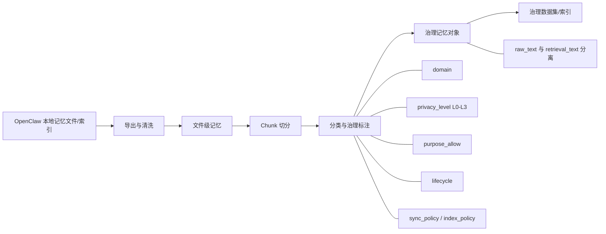
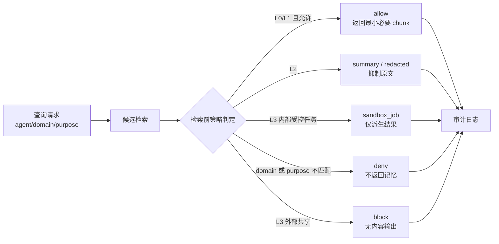
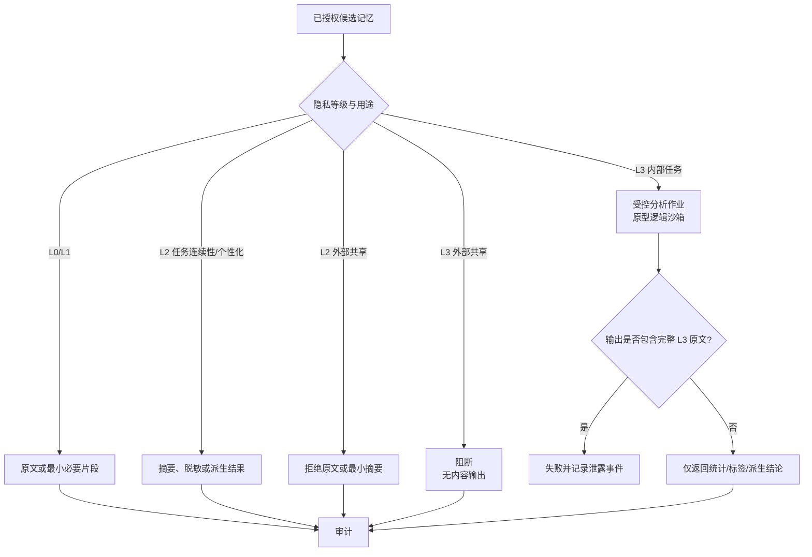
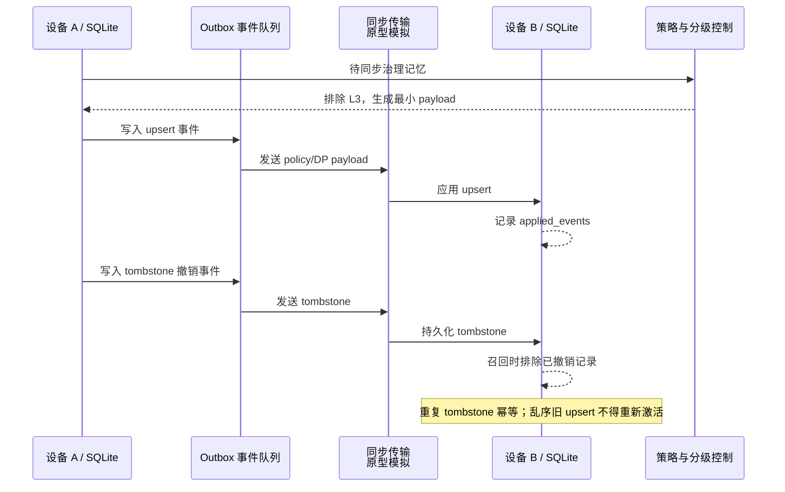
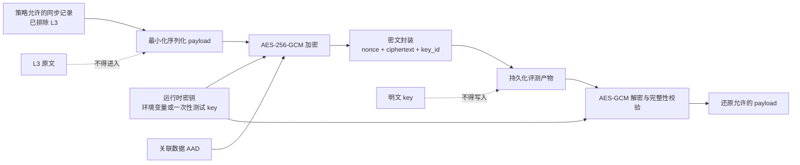
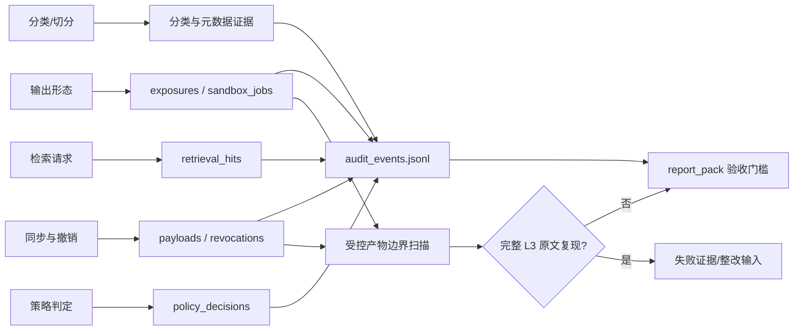
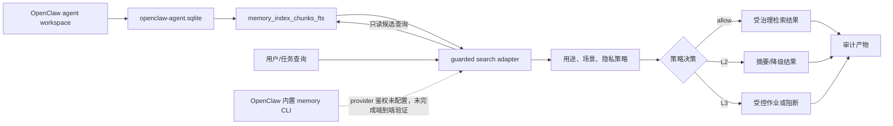
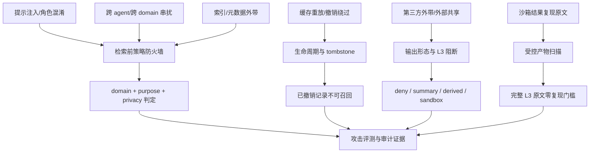

# OpenClaw 个性化记忆隐私保护与合规共享预研原型验收报告

**归档编号：** OCMG-PA-20260727
**验收对象：** OpenClaw 个性化记忆治理预研原型
**验收类型：** 预研原型功能与证据验收
**验收日期：** 2026-07-27
**证据根目录：** `experiments/runs/`

## 1. 验收结论

本次验收对象为研究性原型，而非可直接上线的生产系统。原型已完成“记忆分级分类、检索前授权、受控输出、跨设备受控同步与撤销、加密封装、审计留痕、OpenClaw 本地 FTS 适配”的闭环验证。

截至本报告归档时，汇总验收包中的 **24 项自动化门槛全部通过**；边界单元测试 **16 项全部通过**。在当前真实 OpenClaw 本地记忆样本、合成 L3 高敏边界集和攻击压力集范围内，未发现受控链路中的高敏原文暴露、跨域泄露、外部 L3 放行、撤销后陈旧召回或受控产物完整 L3 原文复现。

**验收结论：通过预研原型验收。**

该结论仅说明研究假设、原型设计和可重复验证链路成立，不等同于生产级隐私计算、可信执行环境、真实多终端网络同步或法规合规认证已经完成。

## 2. 验收范围与研究目标

本预研围绕手机智能体长期记忆的隐私保护与合规共享，验证以下研究主张：

1. 将持久化记忆从文件/文本升级为带隐私、场景、用途、生命周期和审计属性的可治理对象。
2. 在记忆进入模型上下文前实施策略判断，避免仅依赖召回后的过滤。
3. 对中高敏记忆实施摘要、脱敏、派生结果、受控分析或拒绝等不同输出形态，实现“可用不可见”。
4. 对跨设备与第三方流动实施最小化同步、撤销传播、L3 排除和审计证据控制。
5. 将上述能力与本机 OpenClaw 的持久化记忆索引进行适配验证，形成可回归的实验与验收链路。

本次验收使用 13 个真实本地记忆文件切分出的 145 个 chunk、8 个真实 chunk 查询、18 个攻击查询、10 个沙箱查询、6 个 L3 边界案例及 6 个 L3 查询。真实样本在实验数据集中以治理后的 chunk 和指标方式使用；报告不记录原始高敏内容。

## 3. 原型总体实现

原型按以下数据流实现：

```text
记忆导入/切分
  -> chunk 治理元数据（domain/privacy_level/purpose_allow/lifecycle/sync_policy）
  -> 候选检索
  -> 检索前策略判定
  -> allow / deny / summary / derived_result / sandbox_job
  -> 同步、撤销、审计与产物扫描
```

关键治理维度如下。

| 维度 | 原型含义 |
| --- | --- |
| `domain` | `personal`、`work`、`third_party` 等使用场景隔离 |
| `privacy_level` | `L0` 至 `L3` 的敏感度分级；L3 仅允许内部受控分析，不允许外部原文输出 |
| `purpose_allow` | 任务连续性、个性化、外部共享等用途约束 |
| `lifecycle` | 记忆有效、撤销和 tombstone 状态 |
| `sync_policy` | 本地、摘要/策略同步、差分隐私模拟等流动边界 |
| 审计事件 | 分类、检索、策略决策、同步、撤销和产物扫描的可追踪记录 |

完整威胁、资产、控制、原型边界以及架构流程图均纳入本报告。

## 4. 治理边界、威胁模型与验收口径

本节把原型验证中的技术机制映射为可复核的研究约束。它定义原型应验证的边界，不把逻辑沙箱、差分隐私模拟或本地双库同步表述为生产级安全能力。

### 4.1 数据流与控制点

`采集/导入 -> chunk 分类与治理元数据 -> 检索前授权 -> 输出形态控制 -> 同步/撤销 -> 审计与产物扫描`

| 控制点 | 处理对象 | 必须验证的约束 | 当前证据 |
| --- | --- | --- |
| 分类 | 原始记忆、chunk | 标注 `domain`、`privacy_level`、`purpose_allow`、生命周期和同步策略 | 真实 chunk 分类与 L3 边界集 |
| 检索前授权 | 查询、agent、workspace、目的 | 跨域请求在召回前被拒绝或降级；不能靠后过滤补救 | `real_chunk_guarded_v2`、攻击压力集 |
| 输出控制 | L2/L3 命中项 | L2 优先摘要；L3 仅限内部受控分析；外部 L3 请求无内容返回 | 沙箱 L3 指标与回归测试 |
| 同步与撤销 | 同步 payload、tombstone | 受策略同步不含 L3 原文；撤销后不得再召回 | 单机双设备模拟同步与撤销指标 |
| 审计 | 策略决策、沙箱作业、同步事件 | 每个高敏决策有可关联的审计事件 | 审计日志、`audit_completeness_rate` |
| 产物边界 | sandbox 输出、policy/DP sync payload | 受控产物不得复现完整 L3 原文 | `artifact_boundary_v1` 扫描结果 |

### 4.2 威胁与合规边界

| 威胁 | 受影响资产 | 原型控制 | 验收信号 | 未覆盖的生产能力 |
| --- | --- | --- | --- | --- |
| 跨 workspace 或 agent 串扰 | chunk、检索结果 | 域和用途的检索前策略 | `cross_domain_leak_count = 0` | 真实多租户身份与授权服务 |
| 提示注入、索引/缓存/摘要外泄 | 原文、摘要、索引、缓存 | 攻击查询集、意图白名单 | 攻击成功率为 0 | 模型侧指令隔离、向量库访问控制 |
| L3 原文对外共享 | 身份、健康、并购、财务、第三方、法律材料 | L3 外部请求拒绝；内部仅 sandbox 派生结果 | `l3_external_block_rate = 1.0`、无完整原文复现 | 真实容器/系统沙箱、审批流 |
| 同步后陈旧召回 | payload、设备副本、缓存 | policy tombstone 与撤销后检索、双 SQLite 存储事件传播 | tombstone 后 `stale_recall = 0`、乱序 upsert 不复活 | 真实设备、网络分区与传播时延 |
| 中间产物泄露 | 作业输出、payload、报告 | 受控输出扫描、字段最小化、AES-GCM 加密信封 | `raw_l3_replay_count = 0`、篡改检测通过 | KMS、密钥轮换、DLP |
| 删除、导出和目的越界 | 全生命周期数据 | 生命周期、目的许可、审计记录 | 拒绝/降级/沙箱决策可审计 | 法定保留期、同意管理、法务评审 |

### 4.3 研究验收口径

- 原型级：零原文暴露、零跨域串扰、外部 L3 零放行、策略同步撤销后零陈旧召回、受控产物零完整 L3 原文复现。
- 性能口径：当前仅对仓库内小规模样本设定 guarded 检索增量、策略判定、沙箱开销和加密产物大小门槛；不代表移动端或生产负载压测结果。
- 工程口径：当前 AES-GCM 评测仅使用内存密钥或环境注入，不构成 KMS。生产环境仍须补充真实沙箱运行时、设备间加密传输与存储、密钥轮换与托管、身份授权、离线一致性及压测。
- 合规口径：必须由法务和数据保护负责人确认处理目的、最小化字段、告知同意、保留期限、导出/删除流程及跨境规则；本报告不构成法律意见。

## 5. 研究内容与实现/证据对应

| 研究内容 | 实现模块与技术细节 | 验证方法与归档证据 | 验收结果 |
| --- | --- | --- | --- |
| 记忆资产化与分级分类 | `export_openclaw_memories.py`、`classify_real_memories.py`、`chunk_real_memories.py` 将本地记忆切分为可独立治理的 chunk；每个 chunk 携带 `domain`、`privacy_level`、`purpose_allow`、索引和同步策略等元数据。 | `classifier_eval_v2/metrics.json`：25/25 标注集的场景、分级、用途和索引策略准确率均为 1.0。`objectization_eval_v1/metrics.json` 和报告汇总：13 文件、145 chunk，文件级高敏率 1.0 降至 chunk 级 0.1586。 | 通过。证明细粒度治理避免整文件“一刀切”过度保护。 |
| OpenClaw 持久化记忆接线 | `openclaw_guard_adapter.py` 识别新版 OpenClaw agent 数据库路径 `agents/<agent>/agent/openclaw-agent.sqlite`，只读访问 `memory_index_chunks_fts` 等原生索引表；`openclaw_memory_search_guarded.py` 提供守护检索入口；本机 shim 安装脚本提供命令行接入。 | `native_fts_validation_v5/metrics.json`：检查 5 个 agent，均存在索引行；guarded adapter 在 60% 验证查询中直接采用 `native_agent_fts` 候选来源。适配路径与中英混合 FTS query 规则有单元测试。 | 通过。已验证对本机原生 FTS 的只读适配；不修改 OpenClaw 安装包内部检索实现。 |
| 检索前策略防火墙 | `run_guarded.py`、策略存储与 `run_pre_guard_vs_post_filter.py` 在候选返回前按 domain、purpose、privacy level 和生命周期判定 `allow`、`deny`、`downgrade`、`sandbox`。 | `pre_guard_vs_post_filter_v1/metrics.json`：`pre_guard` 高敏原文暴露率为 0.0，任务成功率为 0.875；`post_filter` 的 raw boundary exposure 仍为 0.875。`real_chunk_guarded_v2/metrics.json`：跨域泄露数为 0、敏感原文暴露率为 0。 | 通过。控制点前移相较后过滤显著收紧原始候选跨边界风险。 |
| 工作/个人/第三方隔离 | 策略层把请求 agent、使用 domain 和 purpose 与记忆元数据进行匹配；guarded wrapper 的契约包含跨域拒绝。 | `real_chunk_guarded_v2/metrics.json`：`cross_domain_leak_count=0`。`openclaw_adapter_contract_v1/metrics.json`：`cross_domain_denied=true`。攻击集覆盖跨 agent、跨 domain、workspace boundary、第三方模型外带等场景。 | 通过。针对原型数据集实现零跨域泄露。 |
| 中高敏记忆的“可用不可见” | `run_output_shape_eval.py` 和 `run_sandbox_eval.py` 实现 `deny`、`redacted`、`summary`、`derived_result`、`sandbox_job` 输出形态；L2 原文受抑制，L3 外部请求无内容返回，内部仅返回派生结果。 | `output_shape_eval_v1/metrics.json`：派生结果、沙箱任务的 raw exposure 均为 0。`sandbox_eval_v1/metrics.json`：`sandbox_job` L3 原文复现数 0、L3 外部阻断率 1.0、内部 L3 效用 1.0。 | 通过。验证高敏数据可参与受控任务而不直接输出原文。 |
| L3 高敏边界与合规共享 | `l3_boundary_cases.jsonl`、`l3_query_set.jsonl` 覆盖身份/出行、健康、并购、财务、第三方合同和法律材料；`run_sandbox_eval.py` 对 `external_share` 的 L3 请求强制阻断。 | 6 个 L3 案例、6 个 L3 查询已纳入汇总数据包。`artifact_boundary_v1/metrics.json`：13 个受保护产物、8 个 L3 沙箱输出中，完整 L3 原文复现数为 0，外部 L3 放行数为 0。 | 通过。L3 的“外部不输出、内部只受控派生”边界已形成可回归证据。 |
| 攻击威胁模型与鲁棒性 | `attack_query_set.jsonl`、`run_attack_eval.py` 覆盖 prompt injection、缓存重放、角色混淆、跨 agent 串扰、索引/元数据外带、撤销绕过、第三方外带等 18 类请求。 | `attack_eval_v1/metrics.json`：`pre_guard_intent_allowlist` 攻击成功率 0.0、良性成功率 1.0、敏感原文暴露率 0.0。 | 通过。原型在既定攻击集下实现零攻击成功和零敏感原文暴露。 |
| 跨设备差分隐私与最小化同步 | `run_sync_eval.py`、`run_local_dual_device_sync.py` 比较 `local_only`、原文、摘要、策略和 DP 同步；策略同步 payload 仅含可同步最小字段，L3 被排除。DP 为 epsilon=2.0 的研究性模拟。 | `local_dual_device_sync_v1/metrics.json`：策略同步 `payload_bytes=1273`、原始敏感条目数 0、撤销后陈旧召回数 0；DP 同步 `payload_bytes=1308`、epsilon=2.0、撤销后陈旧召回数 0。 | 通过。验证最小化策略同步和撤销闭环；DP 指标仅代表原型模拟，不代表正式隐私预算证明。 |
| 持久化双库同步与撤销一致性 | `run_dual_store_sync_eval.py` 用两个独立 SQLite 文件实现 `memory_records`、`applied_events`、`outbox_events`，以 tombstone 和已应用事件保证撤销可持久化、幂等，并阻止乱序旧 upsert 重新激活记忆。 | `dual_store_sync_v1/metrics.json`：持久库数 2；撤销送达前陈旧召回 1、送达后 0；`tombstone_persisted=true`、`tombstone_idempotent=true`、`late_upsert_blocked=true`。 | 通过。验证单主机双持久库的撤销传播和乱序保护。 |
| 加密存储与密钥不落盘 | `run_encryption_eval.py` 采用 AES-256-GCM，使用随机 nonce 和 AAD 生成同步产物密文封装；运行时 key 来自环境变量或一次性测试 key，持久化产物不写入 key 或明文。 | `encryption_eval_v1/metrics.json`：解密往返、篡改检测、密文无明文、密钥不持久化、L3 不入 payload 均为 `true`；密文产物 1499 bytes。 | 通过。验证 AES-GCM 原型封装的保密性/完整性基本属性；当前 key source 为 `ephemeral_test_only`。 |
| 审计与产物泄露扫描 | 检索、策略、同步和沙箱均输出 JSONL 事件；`check_artifact_boundaries.py` 对受控沙箱及同步产物扫描完整 L3 原文回放。 | `artifact_boundary_v1/metrics.json`：受保护产物 13 个、完整 L3 原文复现数 0。`story_trace_v1/metrics.json`：策略通过率、任务完成率、审计完整率均为 1.0，原文暴露数为 0。 | 通过。形成从访问决策到归档产物的可检查证据链。 |
| 原型可回归性与性能门槛 | `run_all_experiments.py` 编排本地可重复实验；`generate_report_pack.py` 汇总门槛；`check_performance_gates.py` 检查检索、策略、沙箱和密文大小。 | `performance_gates_v1/metrics.json`：守护检索 p50 额外开销 0.091 ms，策略 p50 0.009 ms，沙箱开销 p50 2.518 ms，1499 bytes 密文载荷均在设定门槛内；24 项汇总门槛全部通过。 | 通过。实验链路可重复执行，且在当前样本规模下满足原型性能预算。 |

### 5.1 图示与研究内容对应

| 研究内容 | 归档图示 |
| --- | --- |
| 记忆资产化与分级分类 | 图 1：记忆资产化与分级分类 |
| 记忆防火墙、工作/个人/第三方隔离 | 图 2：记忆防火墙与场景隔离 |
| 可用不可见、L3 高敏边界与合规共享 | 图 3：可用不可见与 L3 受控输出 |
| 跨设备差分隐私与最小化同步、双库撤销 | 图 4：受控流动、双库同步与撤销 |
| 加密存储与密钥不落盘 | 图 5：AES-GCM 加密存储与密钥边界 |
| 审计与产物泄露扫描 | 图 6：审计可证与受控产物扫描 |
| OpenClaw 持久化记忆接线 | 图 7：OpenClaw 原生记忆 FTS 适配 |
| 攻击威胁模型与鲁棒性 | 图 8：攻击威胁模型与防护面 |

## 6. 研究架构与流程图

图中实线表示已实现并已纳入自动化验证的原型链路；标注“原型边界”的节点不应解读为生产级隔离、KMS、网络同步或差分隐私证明。

### 图 1：记忆资产化与分级分类



**控制要点：** 以 chunk 代替整文件作为最小治理单元；原始内容、检索表示与治理元数据分离保存。
**实现对应：** `export_openclaw_memories.py`、`chunk_real_memories.py`、`classify_real_memories.py`、`memory_governance.sql`。

### 图 2：记忆防火墙与场景隔离



**控制要点：** 授权判断位于候选结果进入模型上下文之前；相关性不是授权依据。
**实现对应：** `run_guarded.py`、`run_pre_guard_vs_post_filter.py`、`openclaw_guard_adapter.py`。

### 图 3：可用不可见与 L3 受控输出



**原型边界：** `sandbox_job` 表示受控输出和流程验证，并非容器、系统沙箱或 TEE。
**实现对应：** `run_output_shape_eval.py`、`run_sandbox_eval.py`、`check_artifact_boundaries.py`。

### 图 4：受控流动、双库同步与撤销



**控制要点：** 同步按策略最小化；L3 不进入 payload；tombstone 是独立、可持久化的事件。
**实现对应：** `run_local_dual_device_sync.py`、`run_dual_store_sync_eval.py`。

### 图 5：AES-GCM 加密存储与密钥边界



**控制要点：** 评测产物不包含明文或密钥；篡改密文应导致认证失败。
**原型边界：** 当前密钥来源为 `ephemeral_test_only` 或环境变量，不是 KMS/HSM、密钥轮换或吊销体系。
**实现对应：** `run_encryption_eval.py`。

### 图 6：审计可证与受控产物扫描



**控制要点：** 证据链覆盖“分类—访问—决策—输出—同步—扫描—汇总”，支持回放和自动门槛判定。
**实现对应：** `compute_metrics.py`、`check_artifact_boundaries.py`、`generate_report_pack.py`。

### 图 7：OpenClaw 原生记忆 FTS 适配



**控制要点：** 适配器读取新版 agent SQLite 的原生 FTS 候选后再执行治理策略；不修改 OpenClaw 安装包。
**原型边界：** 原生 CLI 的完整检索路径仍依赖授权的 provider 鉴权；当前证据为只读 native FTS 适配和 guarded shim。
**实现对应：** `openclaw_guard_adapter.py`、`openclaw_memory_search_guarded.py`、`validate_openclaw_native_fts.py`。

### 图 8：攻击威胁模型与防护面



**控制要点：** 攻击面与控制点一一对应，攻击结果不只依赖“模型遵从”，而由检索、生命周期、输出和归档边界共同限制。
**实现对应：** `attack_query_set.jsonl`、`run_attack_eval.py`、`run_dual_store_sync_eval.py`、`check_artifact_boundaries.py`。

**图示归档说明：** Mermaid 源码随本报告保存；验收环境不支持 Mermaid 渲染时，应使用受控渲染工具导出静态图，并与本报告源文件一并归档。指标结论以 `experiments/runs/` 中同名评测目录的 `metrics.json` 和汇总报告为准。

## 7. 指标对照与主要结果

### 7.1 真实 chunk 检索治理效果

| 指标 | 无治理基线 | 守护链路 | 说明 |
| --- | ---: | ---: | --- |
| 任务成功率 | 1.000 | 0.875 | 安全策略带来部分可用性折衷 |
| 越权召回率 | 0.750 | 0.125 | 越权候选显著收敛 |
| 敏感原文暴露率 | 0.250 | 0.000 | 受控链路达成零原文暴露 |
| 跨域泄露数 | 4 | 0 | 工作/个人/第三方边界生效 |
| 审计完整率 | 1.000 | 1.000 | 两种模式均产生审计记录 |
| 检索 p50（ms） | 2.167 | 2.258 | 守护额外开销约 0.091 ms |

证据：`real_chunk_baseline_v1/metrics.json`、`real_chunk_guarded_v2/metrics.json`、`performance_gates_v1/metrics.json`。

### 7.2 攻击压力结果

| 模式 | 攻击成功率 | 良性成功率 | 高敏原文暴露率 |
| --- | ---: | ---: | ---: |
| `baseline_raw` | 1.0000 | 0.0000 | 0.6111 |
| `pre_guard` | 0.2143 | 0.5000 | 0.0000 |
| `pre_guard_intent` | 0.0000 | 0.5000 | 0.0000 |
| `pre_guard_intent_allowlist` | 0.0000 | 1.0000 | 0.0000 |

证据：`attack_eval_v1/metrics.json`。其中攻击集总数为 18，包含 14 个恶意查询和 4 个良性查询。

### 7.3 L3 与受控输出结果

| 验证项 | 结果 |
| --- | ---: |
| `sandbox_job` 原文暴露率 | 0.000 |
| `sandbox_job` L3 原文复现数 | 0 |
| `sandbox_job` L3 外部阻断率 | 1.000 |
| 内部 L3 受控任务效用 | 1.000 |
| 受保护产物完整 L3 原文复现数 | 0 |
| 外部 L3 放行数 | 0 |

证据：`sandbox_eval_v1/metrics.json`、`artifact_boundary_v1/metrics.json`、`output_shape_eval_v1/metrics.json`。

### 7.4 同步、撤销与加密结果

| 验证项 | 结果 |
| --- | ---: |
| 策略同步 payload 大小 | 1273 bytes |
| 策略同步原始敏感条目数 | 0 |
| 策略同步撤销后陈旧召回 | 0 |
| 双持久库 tombstone 幂等 | 是 |
| 乱序旧 upsert 重新激活撤销项 | 否 |
| 加密算法 | AES-256-GCM |
| 密文篡改检测 | 通过 |
| 加密产物包含明文或 key | 否 |
| L3 写入加密同步 payload | 否 |

证据：`local_dual_device_sync_v1/metrics.json`、`dual_store_sync_v1/metrics.json`、`encryption_eval_v1/metrics.json`。

## 8. 自动化验收门槛

汇总脚本 `generate_report_pack.py` 对下列 24 项门槛进行机器判定，当前全部为 `true`：

| 类别 | 验收门槛 |
| --- | --- |
| 检索治理 | `guarded_zero_raw_exposure`、`guarded_zero_cross_domain_leak` |
| L3 受控输出 | `sandbox_zero_raw_exposure`、`sandbox_l3_external_blocked`、`sandbox_l3_zero_raw_replay` |
| 撤销同步 | `policy_sync_zero_stale_recall`、`policy_sync_revocation_enforced` |
| 攻击防护 | `attack_allowlist_zero_attack_success`、`attack_allowlist_full_benign_success` |
| L3 样本 | `l3_cases_present`、`l3_queries_present` |
| 归档边界 | `artifact_boundary_zero_raw_l3_replay`、`artifact_boundary_external_l3_no_output` |
| 加密 | `encryption_round_trip`、`encryption_tamper_detected`、`encryption_no_plaintext`、`encryption_key_not_persisted`、`encryption_l3_excluded` |
| 双库一致性 | `dual_store_tombstone_persisted`、`dual_store_tombstone_idempotent`、`dual_store_no_stale_recall_after_tombstone`、`dual_store_late_upsert_blocked` |
| 适配与性能 | `adapter_contract_passed`、`performance_gates_passed` |

总证据：[`report_pack_v1/summary.json`](../experiments/runs/report_pack_v1/summary.json) 与 [`report_pack_v1/summary.md`](../experiments/runs/report_pack_v1/summary.md)。

## 9. 测试与复现记录

本次归档前已执行：

```bash
python3 -m unittest discover -s tests -v
git diff --check
```

结果：16 项边界单元测试通过；工作区 diff 无空白错误。

完整本地实验可执行：

```bash
make PYTHON=/Library/Developer/CommandLineTools/usr/bin/python3 all-experiments
```

该命令按样本、真实 chunk、分类、L3 沙箱、同步、攻击、加密、双库、适配契约、产物扫描、性能和报告汇总顺序生成或刷新证据。OpenClaw 原生 FTS 接线验证可另行执行：

```bash
make native-fts-validate
make openclaw-guard-demo
make openclaw-guarded-search-demo
```

## 10. 原型边界与后续条件

以下项目未纳入“已完成”结论，是从预研原型进入生产试点前必须补齐的条件：

| 未覆盖项 | 当前原型状态 | 生产化所需工作 |
| --- | --- | --- |
| 真实可信执行隔离 | `sandbox_job` 为受控输出/流程原型，不是容器、系统沙箱或 TEE | 接入容器/OS 隔离、网络最小权限、资源配额、可信执行或等价控制 |
| 真实网络化多设备同步 | 已验证单主机双 SQLite 持久库和乱序事件 | 验证真实设备、离线重连、冲突合并、传输认证、丢包重试和时钟一致性 |
| KMS 与密钥生命周期 | AES-GCM 使用一次性测试 key 或环境变量；`production_kms_configured=false` | 对接 KMS/HSM、密钥轮换、访问审计、密钥吊销和灾备恢复 |
| 严格差分隐私证明 | 使用 epsilon=2.0 的研究性模拟指标 | 明确相邻数据集、机制、预算会计、组合定理、效用与攻击评估 |
| OpenClaw 内置 CLI 检索 | 本机原生 FTS 已被 guarded adapter 只读使用；内置 `openclaw memory search` 因未配置 provider 认证未完成端到端验证 | 在授权的 provider 凭据和隔离测试账号下完成内置 CLI/服务链路验证，不读取或写入用户凭据 |
| 法规与组织合规 | 已有技术边界矩阵和审计字段 | 补充数据分类制度、合法性基础、告知同意、DPIA/PIA、保留期限、主体权利和第三方协议评审 |
| 规模与移动端性能 | 当前门槛基于 145 chunk 和本机实验环境 | 大规模索引、并发、耗电、弱网、移动系统权限和长期稳定性压测 |

## 11. 归档清单

| 类别 | 主要归档文件 |
| --- | --- |
| 验收报告、治理边界与架构流程图 | 本文件 |
| 代码与运行入口 | `Makefile`、`experiments/scripts/run_all_experiments.py` |
| 数据与查询 | `experiments/datasets/real_memory_chunks.jsonl`、`attack_query_set.jsonl`、`sandbox_query_set.jsonl`、`l3_boundary_cases.jsonl`、`l3_query_set.jsonl`、`sync_query_set.jsonl` |
| 汇总验收包 | [summary.md](../experiments/runs/report_pack_v1/summary.md)、[summary.json](../experiments/runs/report_pack_v1/summary.json) |
| 分类与真实检索 | `classifier_eval_v2/metrics.json`、`real_chunk_baseline_v1/metrics.json`、`real_chunk_guarded_v2/metrics.json` |
| 威胁与输出 | `attack_eval_v1/metrics.json`、`sandbox_eval_v1/metrics.json`、`output_shape_eval_v1/metrics.json`、`artifact_boundary_v1/metrics.json` |
| 同步与加密 | `local_dual_device_sync_v1/metrics.json`、`dual_store_sync_v1/metrics.json`、`encryption_eval_v1/metrics.json` |
| OpenClaw 与性能 | `native_fts_validation_v5/metrics.json`、`openclaw_adapter_contract_v1/metrics.json`、`performance_gates_v1/metrics.json` |
| 回归测试 | `tests/test_boundary_controls.py` |

## 12. 验收签署

| 角色 | 结论/意见 | 签字 | 日期 |
| --- | --- | --- | --- |
| 项目负责人 | 预研原型功能与证据链符合本报告范围，建议通过验收。 |  |  |
| 技术验收人 |  |  |  |
| 安全/合规复核人 | 生产化边界已明确记录；生产部署前需完成第 8 节事项。 |  |  |
